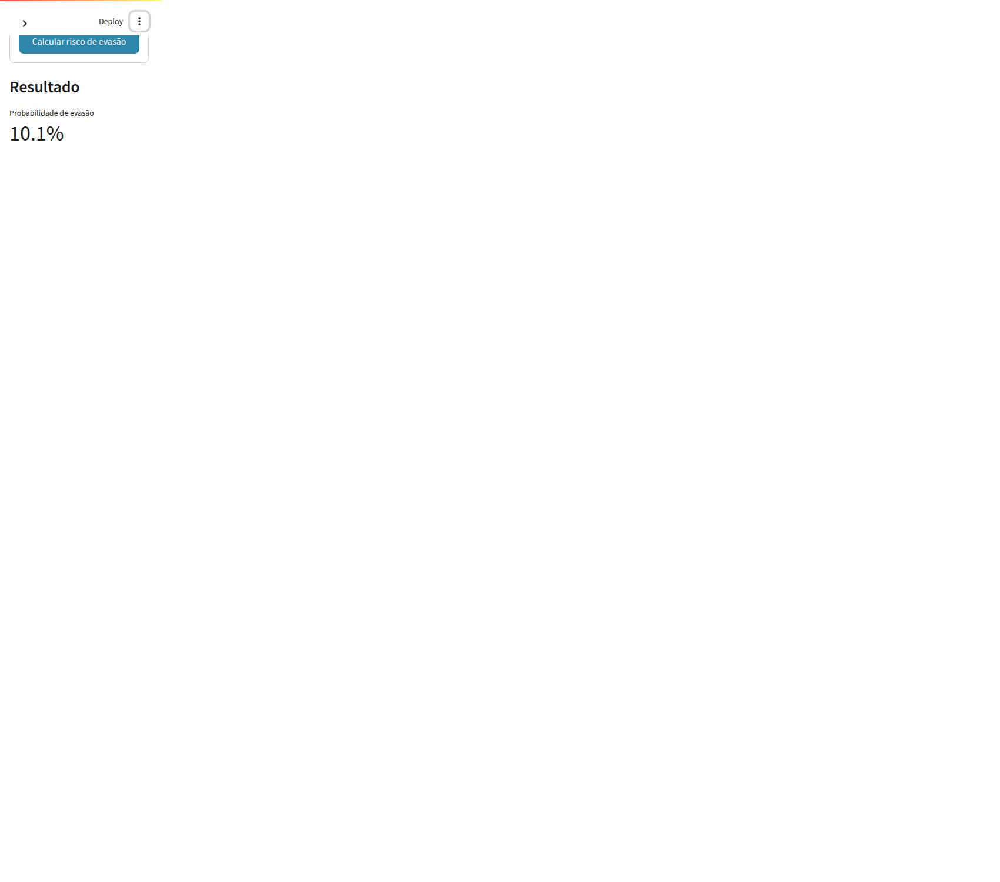

# Tech Challenge — Fase 3 | Machine Learning Engineering (FIAP)

## 🎯 Objetivo do projeto

Desenvolver uma **pipeline de Machine Learning** capaz de prever, de forma
**binária**, a **evasão de estudantes** de uma instituição de ensino, a partir de
dados socioeconômicos, de admissão e de desempenho acadêmico.

O projeto cobre o ciclo completo: análise exploratória, limpeza e *feature engineering*,
treino com validação cruzada, análise de *overfitting*/*underfitting*, serialização do
modelo e **deploy de uma aplicação Streamlit** para uso interativo.

> Status atual: **todas as fases concluídas** — pipeline de dados, modelagem, seleção do
> modelo final, avaliação única no teste, serialização, aplicação Streamlit e roteiro do
> vídeo (**149 testes passando**). Falta apenas publicar no GitHub, no Streamlit Cloud e
> gravar o vídeo. Detalhes em [`PROJECT_PLAN.md`](PROJECT_PLAN.md).

## 🎓 Contexto acadêmico

- **Curso:** Pós-Graduação em Machine Learning Engineering — FIAP
- **Disciplina/Entrega:** Tech Challenge — Fase 3
- **Enunciado:** `docs/MLET - Prova Substitutiva - Fase 3.pdf`
- **Base de dados:** `StudentsPrepared.xlsx` — "Base Sub Fase 3" fornecida pela FIAP.
- **Requisitos avaliados:** *feature engineering* (numéricas e categóricas), divisão
  treino/teste, modelo binário com validação cruzada, análise justificada de
  *overfitting*/*underfitting*, deploy em Streamlit, repositório no GitHub com documentação
  e vídeo explicativo de no mínimo 5 minutos.

### Unidade de análise (D9)

**Uma linha representa um estudante.** Essa definição foi **confirmada pela documentação
original da base UCI** (*Predict Students' Dropout and Academic Success*), na qual cada
registro corresponde a um estudante único. A base não possui coluna de identificador — o
que reforça a necessidade dessa definição explícita.

## 🗂️ Estrutura planejada

```
tech-challenge-fase3/
├── data/
│   ├── raw/                       # StudentsPrepared.xlsx (cópia imutável)      ✅ Fase 1
│   └── processed/                 # students_processed.csv                     ✅ Fase 1
├── docs/
│   ├── MLET - Prova Substitutiva - Fase 3.pdf
│   └── entregas/
│       └── links.txt              # repositório + app + vídeo                 ⏳ Fase 4
├── notebooks/
│   └── 01_eda_e_modelagem.ipynb   # EDA + modelagem (executado)               ✅ Fase 3
├── docs/
│   ├── roteiro-video.md           # roteiro de gravacao do video              ✅ Fase 4
│   └── entregas/links.txt         # arquivo .txt da entrega                   ⏳ preencher
├── src/
│   ├── config.py                  # RANDOM_STATE, caminhos, cenários          ✅ Fase 1
│   ├── schema.py                  # validação de schema                       ✅ Fase 1
│   ├── grade_scale.py             # núcleo puro da correção de notas          ✅ Fase 1
│   ├── cleaning.py                # notas, duplicatas, alvo                   ✅ Fase 1
│   ├── data_loader.py             # carga + integridade SHA-256               ✅ Fase 1
│   ├── build_dataset.py           # orquestra e gera o relatório              ✅ Fase 1
│   ├── features.py                # features derivadas (linha a linha)       ✅ Fase 2
│   ├── preprocessing.py           # ColumnTransformer / Pipeline              ✅ Fase 2
│   ├── evaluate.py                # métricas, tabelas e gráficos             ✅ Fase 2
│   ├── train.py                   # CV + GridSearch + cenários               ✅ Fase 2
│   ├── select_model.py            # modelo final + teste único + limiar      ✅ Fase 3
│   ├── predict.py                 # inferência (usada pelo app e testes)      ✅ Fase 3
│   └── form_spec.py               # campos do formulário da aplicação        ✅ Fase 4
├── app/
│   └── streamlit_app.py           # aplicação de deploy                       ✅ Fase 4
├── models/                        # model.joblib + metadados                   ✅ Fase 3
├── reports/
│   ├── tables/                    # CSV com os resultados da Fase 2           ✅ Fase 2
│   ├── figures/                   # gráficos (Fase 2: 13 PNGs)                ✅ Fase 2
│   ├── phase2_model_comparison.md # relatório de modelos e cenários           ✅ Fase 2
│   ├── phase3_final_model.md      # relatório do modelo final                 ✅ Fase 3
│   ├── data_quality_report.md     # relatório de qualidade                    ✅ Fase 1
│   └── data_quality_report.json   # versão machine-readable                    ✅ Fase 1
├── tests/
│   ├── test_grade_scale.py        # núcleo da correção (sem pandas)           ✅ Fase 1
│   ├── test_cleaning.py           # limpeza, duplicatas e alvo                 ✅ Fase 1
│   ├── test_schema.py             # validação de schema                        ✅ Fase 1
│   ├── test_data_integrity.py     # SHA-256 da base bruta                     ✅ Fase 1
│   ├── test_features.py           # features derivadas                         ✅ Fase 2
│   ├── test_preprocessing.py      # ColumnTransformer e Pipeline              ✅ Fase 2
│   ├── test_select_model.py       # seleção, diagnóstico e limiar              ✅ Fase 3
│   ├── test_predict.py            # API de inferência                          ✅ Fase 3
│   ├── test_form_spec.py          # campos do formulário                       ✅ Fase 4
│   └── test_app.py                # exemplos e integração com o app            ✅ Fase 4
├── requirements.txt               ✅ Fase 1
├── pytest.ini                     ✅ Fase 1
├── PROJECT_PLAN.md
└── README.md
```

> O ambiente virtual `.venv/` foi criado localmente e **não** é versionado.

## 🧭 Decisões metodológicas confirmadas

| ID | Decisão |
|---|---|
| **D1** | Alvo principal: `Desistente = 1`; `Graduado` + `Matriculado` = 0. Alvo de sensibilidade (exclui `Matriculado`): `Desistente = 1` vs. `Graduado = 0`. |
| **D2** | Dois cenários comparados: **Early Warning** (cadastro, socioeconômico, financeiro, ingresso e 1º semestre) e **Completo** (+ 2º semestre). O *Early Warning* é o candidato preferencial ao deploy; o Completo é o benchmark. |
| **D3** | `MensalidadesEmDia` e `Devedor` **não** são removidos automaticamente: há análise de ablação com e sem eles. A dependência temporal é tratada como hipótese a documentar, não como fato. |
| **D4** | Correção autorizada das colunas `...SemestreGrau` (dividir por 10 enquanto o valor exceder 20). O arquivo original permanece intacto; a correção ocorre apenas no pipeline. |
| **D5** | `StudentsPrepared.xlsx` é a "Base Sub Fase 3". Cópia de trabalho em `data/raw`; processados em `data/processed`. |
| **D6** | Ambiente em **Python 3.12** (não desenvolver em 3.14). |
| **D7** | Variáveis macroeconômicas mantidas inicialmente; contribuição avaliada por validação cruzada e removidas só se não agregarem. Sem PCA. |
| **D8** | **F2-score** como métrica de otimização; reportar Accuracy, Precision, Recall, F1, F2, ROC-AUC e matriz de confusão. Thresholds escolhidos na validação, nunca no teste. |
| **D9** | Uma linha = um estudante (confirmado pela documentação original da base UCI). Duplicata exata removida no estágio processado. |
| **D10** | Deploy no Streamlit Community Cloud, preferencialmente com o modelo Early Warning. O app deve deixar claro que a saída é **risco**, não decisão automática. |

## ⚙️ Instruções de configuração e execução

> ✅ **Ambiente já instalado e validado.** O Python **3.12.14** foi instalado pelo `uv` em
> `/home/rodrigo/.local/share/uv/python` (sem `sudo`, sem alterar o sistema) e o ambiente
> virtual do projeto está em `.venv/`. Para ativar:
>
> ```bash
> source .venv/bin/activate
> ```
>
> O projeto **não** deve ser desenvolvido com o Python 3.14 do sistema (D6). As dependências
> estão fixadas em `requirements.txt`.

**Requisitos**

```text
Python 3.12
pandas 2.2.3 · numpy 2.1.3 · openpyxl 3.1.5
scikit-learn 1.5.2 · joblib 1.4.2
matplotlib 3.9.2 · seaborn 0.13.2
streamlit 1.40.2
ipykernel 6.29.5 · nbformat 5.10.4
pytest 8.3.4
```

**Passos**

1. Clonar o repositório e entrar na pasta:
   ```bash
   git clone <URL_DO_REPOSITORIO>
   cd tech-challenge-fase3
   ```

2. **Criar o ambiente virtual com Python 3.12** (obrigatório):
   ```bash
   # Linux/macOS
   python3.12 -m venv .venv
   source .venv/bin/activate
   ```
   ```powershell
   # Windows
   py -3.12 -m venv .venv
   .venv\Scripts\activate
   ```

3. Instalar as dependências:
   ```bash
   python -m pip install --upgrade pip
   pip install -r requirements.txt
   ```

4. Executar a Fase 1 (gera a base processada e o relatório de qualidade):
   ```bash
   python -m src.build_dataset
   ```

5. Rodar os testes automatizados:
   ```bash
   pytest
   ```

6. Executar a Fase 2 (compara modelos e cenários; leva alguns minutos):
   ```bash
   python -m src.train
   ```

7. Executar a Fase 3 (seleciona o modelo, avalia o teste **uma vez** e serializa):
   ```bash
   python -m src.select_model
   ```

8. Abrir o notebook executável no VS Code:
   `notebooks/01_eda_e_modelagem.ipynb`

9. Executar a aplicação Streamlit:
   ```bash
   streamlit run app/streamlit_app.py
   ```

**Reproduzindo o ambiente do zero (referência)**

O ambiente desta máquina foi criado com `uv` (Opção A). Em outra máquina, repita:

```bash
# Opcao A - uv (recomendada)
curl -LsSf https://astral.sh/uv/install.sh | sh
uv python install 3.12
uv venv --python 3.12 --seed .venv
source .venv/bin/activate
uv pip install -r requirements.txt
```

Alternativas:

*Opção B — `pyenv`*
```bash
curl -fsSL https://pyenv.run | bash
# siga as instruções de PATH exibidas ao final da instalação
pyenv install 3.12.8   # ou a última 3.12.x disponível
pyenv local 3.12.8
python -m venv .venv && source .venv/bin/activate
pip install -r requirements.txt
```

*Opção C — pacote do sistema (requer `sudo`)*
```bash
sudo apt update && sudo apt install -y python3.12 python3.12-venv
python3.12 -m venv .venv && source .venv/bin/activate
pip install -r requirements.txt
```

**Resultado da execução da Fase 1**

```text
Linhas brutas ............: 4424
Linhas processadas .......: 4423   (1 duplicata exata removida)
Valores de nota corrigidos: 3465   (1790 no 1o semestre + 1675 no 2o semestre)
Valores ausentes .........: 0
Alvo principal (D1) ......: 1420 evasoes / 3003 nao evasoes (32,1% positivos)
Alvo de sensibilidade ....: 1420 evasoes / 2209 graduados (794 excluidos)
Testes automatizados .....: 67 passando
```

Artefatos gerados:

- `data/processed/students_processed.csv` (4.423 linhas x 31 colunas)
- `reports/data_quality_report.md` e `reports/data_quality_report.json`

**Resultado da execução da Fase 2**

Comparação de 6 modelos × 5 cenários, com `StratifiedKFold(5)` e ajuste de hiperparâmetros
por **F2-score**. O conjunto de teste (1.327 linhas) **não** foi avaliado — está congelado
para a Fase 3.

| Cenário | Melhor modelo | F2 (CV) | Recall | Gap treino−CV |
|---|---|---|---|---|
| Completo | `logistic_balanced` | **0,7945** | 0,8048 | 0,0170 |
| Completo sem macro | `logistic_balanced` | 0,7913 | 0,7998 | 0,0174 |
| Early Warning | `logistic_balanced` | **0,7712** | 0,7817 | **0,0110** |
| Early Warning sem financeiras | `logistic_balanced` | 0,7487 | 0,7626 | 0,0062 |
| *(referência)* | `dummy_prior` | 0,0000 | 0,0000 | — |

**Principais conclusões:**

- `class_weight="balanced"` é a maior alavanca: +7 p.p. de F2 na Regressão Logística.
- A **Regressão Logística balanceada** vence em todos os cenários, com o menor gap
  treino−validação (~0,01) — ou seja, **não** apresenta overfitting.
- O **Random Forest padrão sofre overfitting severo** (F2 de treino 1,0000 vs. 0,7419 na
  validação); o ajuste de profundidade corrige e ainda melhora a validação para 0,7800.
- O cenário **Completo supera o Early Warning em apenas ~2,3 p.p.**, ao custo de esperar o
  2º semestre → o **Early Warning** segue como candidato ao deploy (D2).
- Remover as variáveis **financeiras** piora o modelo (−2,25 p.p.); remover as **macroeconômicas**
  quase não muda nada (−0,15 p.p.) — contribuição marginal (D7).

Relatório completo: [`reports/phase2_model_comparison.md`](reports/phase2_model_comparison.md)

**Resultado da Fase 3 (modelo final)**

| Item | Valor |
|---|---|
| Modelo | `LogisticRegression(class_weight="balanced", C=0.1)` |
| Cenário | **Early Warning** (24 features) — deploy (D2) |
| Limiar de decisão | **0,40** (escolhido na validação, nunca no teste) |

| Nível | F2 | Recall | Precision | ROC-AUC |
|---|---|---|---|---|
| Treino | 0,8070 | — | — | — |
| Validação cruzada | 0,7712 | 0,7817 | 0,7336 | 0,8933 |
| **Teste (uma vez, n=1.327)** | **0,8136** | **0,8568** | 0,6772 | **0,9071** |

**Matriz de confusão no teste:** 727 verdadeiros negativos · 174 falsos positivos ·
**61 evasões não detectadas** · 365 evasões corretas.

**Diagnóstico: `ajuste_adequado`** — gap treino−CV de 0,0358 (tolerância 0,05) e o teste
foi até **melhor** que a validação (gap CV−teste = −0,0424). Não há sinal de overfitting.

**A decisão de negócio do limiar:** baixar de 0,50 para 0,40 faz o modelo capturar
**19 evasões a mais** (61 em vez de 80 não detectadas), ao custo de 57 alarmes falsos.
Como o objetivo é retenção, a troca se justifica (D8).

Relatório completo: [`reports/phase3_final_model.md`](reports/phase3_final_model.md)

---

## 🖥️ Aplicação Streamlit



A aplicação recebe os dados de um estudante (cadastro, financeiro, ingresso e 1º semestre) e
devolve a **probabilidade de evasão**, a faixa de risco e uma recomendação de ação.

**Princípios de uso (D10):** o resultado é apresentado como **risco**, nunca como decisão
automática. A aplicação exibe sempre o aviso de que se trata de uma estimativa, útil para
**priorizar** o acompanhamento humano.

```bash
streamlit run app/streamlit_app.py
```

Na barra lateral há dois botões de exemplo — **risco alto** e **risco baixo** — para
demonstrar os extremos rapidamente. Verificado em execução:

| Perfil | Probabilidade | Faixa |
|---|---|---|
| Devedor, mensalidades em atraso, sem bolsa, 0 aprovações | **98,7%** | 🔴 Alto |
| Mensalidades em dia, bolsista, 6 aprovações, média 15,5 | **10,1%** | 🟢 Baixo |

### Deploy no Streamlit Community Cloud

1. Publique o repositório no GitHub (`git push`).
2. Acesse <https://share.streamlit.io> e entre com a conta do GitHub.
3. **New app** → selecione o repositório.
4. Em *Main file path*, informe `app/streamlit_app.py`.
5. **Deploy** e aguarde a instalação das dependências.
6. Copie a URL pública para `docs/entregas/links.txt`.

> O modelo (`models/model.joblib`) está versionado, então o deploy **não** treina nada.

---

## 📹 Vídeo e entrega

- **Roteiro de gravação:** [`docs/roteiro-video.md`](docs/roteiro-video.md) — bloco a bloco,
  com marcação de tempo e os números reais do projeto.
- **Arquivo de entrega:** [`docs/entregas/links.txt`](docs/entregas/links.txt) — repositório,
  aplicação e vídeo (preencher os links antes de enviar).
